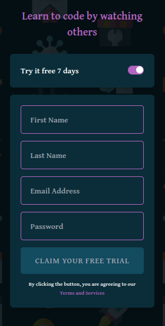

# Intro-Component

Here is my alternative example, original figma vers was not my style and I Changed it.

# Frontend Mentor - Intro component with sign up form solution

This is a solution to the [Intro component with sign up form challenge on Frontend Mentor](https://www.frontendmentor.io/challenges/intro-component-with-signup-form-5cf91bd49edda32581d28fd1). Frontend Mentor challenges help you improve your coding skills by building realistic projects.

## Table of contents

- [Overview](#overview)
  - [The challenge](#the-challenge)
  - [Screenshot](#screenshot)
  - [DarkMode](#darkmode)
  - [Gif](#gif)
  - [Links](#links)

## Overview

### The challenge

Users should be able to:

- View the optimal layout for the site depending on their device's screen size
- See hover states for all interactive elements on the page
- Receive an error message when the `form` is submitted if:
  - Any `input` field is empty. The message for this error should say _"[Field Name] cannot be empty"_
  - The email address is not formatted correctly (i.e. a correct email address should have this structure: `name@host.tld`). The message for this error should say _"Looks like this is not an email"_

### Screenshot

### DarkMode

### Gif

### Links

- Solution URL: [Github Repo](https://github.com/vaaakoo/Intro-Component)
- Live Site URL: [Live Demo](https://vaaakoo.github.io/Intro-Component/)

## Thanks FrontEnd Mentor for challenges
